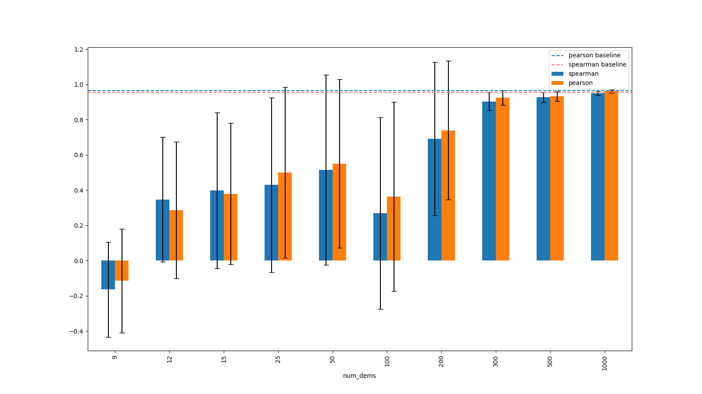

# procedural-generalization

Testing the generalization properties of [T-REX](https://github.com/hiwonjoon/ICML2019-TREX/blob/master/atari/LearnAtariReward.py) algorithm on [Procgen](https://github.com/openai/procgen) suite of environments

## Setup

To setup the environment use the following commands:

```
git clone https://github.com/lzil/procedural-generalization.git
conda env update --name trex-procgen --file procedural-generalization/trex/environment.yml
conda activate trex-procgen
pip install https://github.com/openai/baselines/archive/9ee399f5b20cd70ac0a871927a6cf043b478193f.zip  
```

Then download the pre-generated demo's [here](https://drive.google.com/drive/folders/1DjGpKnXip6WBXuHzajt1FaiWGU7s4338?usp=sharing) and put into `trex/demos` folder 

To generate fresh demos yourself, use e.g.  
```python gen_demos.py  --models_dir experts/fruitbot/easy/checkpoints --env_name fruitbot --name fruitbot_sequential --num_dems 200```  
After downloading the [expert policies](https://drive.google.com/drive/folders/1-LnTGdBjuIIBPo7BIu1uwB7K9qlAMvJH?usp=sharing) and putting them into `trex/experts` folder  
You can also train experts yourself using the code available in the [train-procgen repo](https://github.com/openai/train-procgen) as we did


## Training reward models with T-REX algorithm


Now the `demos` folder should contain the sufficient amount of demos for the envirionment in question. The provided demos have different attained returns (the experts purposefully chosen to have varied skill levels)

The algorithm will create the training data by selecting the requested number of demos from the available ones,
then picking the pairs of clips coming from different demos and assigning preference in each clip based on the return of the demo that it came from.
Having this training set, the we train the reward model that would fit the created data

You can check the detailed desctiption of the algorithm in the [paper](https://arxiv.org/abs/1904.06387) by Brown et al.


To train reward for the `fruitbot` given 200 demos run:  
`python train_reward.py --env_name fruitbot --num_dems 200`

Many algorithm hyperparameters could be specified from the command line   
Check `python train_reward.py --help` for the full list

To run several experiments at a time with different hyperparameters use `run_experiments.py`. For example:  
`python run_experiments.py --env_name starpilot fruitbot coinrun --num_dems 30 100 200 500 1000 --num_seeds 5 --save_name NEW_RUN`  
will run 3(envirionments) x 5(different # of demos) x 5(random seeds) = 75 experiments and save the details of the reward models to `reward_models/rm_infos_NEW_RUN.csv` file

---

## Plotting the reward model correlations

We can evaluate the quality of a given model with a simple metric: the correlation between the real return of a trajectory and the predicted return from the reward model.

The [spearman](https://en.wikipedia.org/wiki/Spearman%27s_rank_correlation_coefficient) and [pearson](https://en.wikipedia.org/wiki/Pearson_correlation_coefficient) correlations of the learned reward model with the true reward are calculated at the end of training and saved in the .csv file

Simply run  e.g.:  
`python plot_correlations.py --rm_csv_path reward_models/rm_infos_NEW_RUN.csv --env_name fruitbot` 

The sample output will look like this:




Baselines are computed by measuring correlation with the reward model that assings +1 reward to every state


---

## recording and watching videos

### policy

Tesing a trained agent saved in `policy.parameters` can be done with e.g.:  
`python test_policy.py --load_path policy.parameters --env_name Name`

You can also record a video of the trained agent with e.g.:  
`python rec_video.py --load_path policy.parameters --env_name Name`

Additional argumets are available


### demonstration

Produce a demonstration file with
`python visualize_demo <demo_path>`
and it will appear in `videos/demo_<demo_id>.mp4`.

Slight problem: when you run it, it prints a lot of stuff.
I haven't been able to figure out how to get rid of it - it may be a Mac thing.
But the produced video is unaffected.
